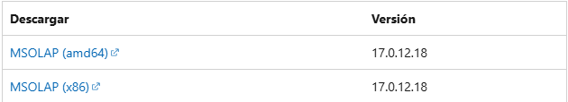

# Consumo de Cubos Dinámicos

Este proyecto tiene como objetivo conectarse y consumir datos desde cubos OLAP de SQL Server Analysis Services (SSAS) a través de una API desarrollada en Python.

### Entorno de trabajo para ejecutar la API

- Sistema operativo: Windows  
- Python: 3.12  
- DB: SQL Server  
- Driver: MSOLAP

Es necesario instalar las [Bibliotecas cliente de Analysis Services](https://learn-microsoft-com.translate.goog/en-us/analysis-services/client-libraries?view=asallproducts-allversions&_x_tr_sl=en&_x_tr_tl=es&_x_tr_hl=es&_x_tr_pto=tc), según la versión que corresponda a tu entorno. A continuación se muestra una imagen referencial:



Una vez instaladas las bibliotecas, se deben instalar las siguientes dependencias ejecutando los siguientes comandos en la terminal:

```bash
pip install pandas      # Librería para análisis y manipulación de datos con estructuras tipo DataFrame.
pip install pywin32     # Permite interactuar con APIs de Windows (COM, automatización de Office, etc.).
pip install openpyxl    # Permite leer y escribir archivos Excel (.xlsx) en Python.
```
Para ejecutar la API, simplemente corre el siguiente comando:

```bash
python api.py
```
### Entorno de trabajo para consumir la API
 - Sistema operativo: Multiplataforma
 - Python: 3.12
Para consumir la API, es necesario instalar las siguientes librerías:

```bash

pip install uvicorn     # Servidor ASGI ultrarrápido para ejecutar aplicaciones web asincrónicas.
pip install fastapi     # Framework web moderno y veloz para construir APIs REST con tipado automático.
```